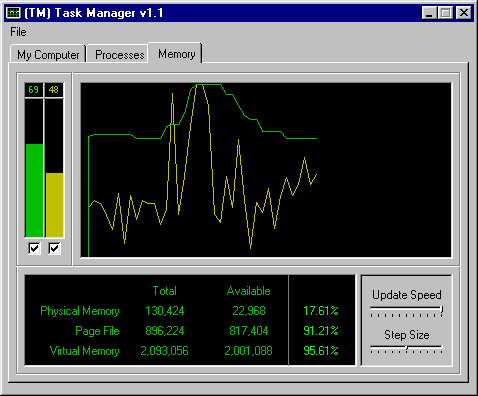



## TM \(TaskManager\)

### Description

A complete Task Manager for windows 95/98! Graphical memory and Processor load graphs, process information, as well as computer information. Kill processes, set priorities, etc. Highly customizable and with a cool interface, methinks this code rocks! Spans of how-to's inside. Check it out. And, please, vote!
 
### More Info
 

             |
---                |---
**Submitted On**   |2001-02-20 21:37:38
**By**             |[Andreas Laubscher](https://github.com/Planet-Source-Code/PSCIndex/blob/master/ByAuthor/andreas-laubscher.md)
**Level**          |Intermediate
**User Rating**    |5.0 (105 globes from 21 users)
**Compatibility**  |VB 6\.0
**Category**       |[Windows System Services](https://github.com/Planet-Source-Code/PSCIndex/blob/master/ByCategory/windows-system-services__1-35.md)
**World**          |[Visual Basic](https://github.com/Planet-Source-Code/PSCIndex/blob/master/ByWorld/visual-basic.md)
**Archive File**   |[CODE\_UPLOAD152552202001\.zip](https://github.com/Planet-Source-Code/andreas-laubscher-tm-taskmanager__1-21195/archive/master.zip)

### API Declarations

Spans of declarations...

